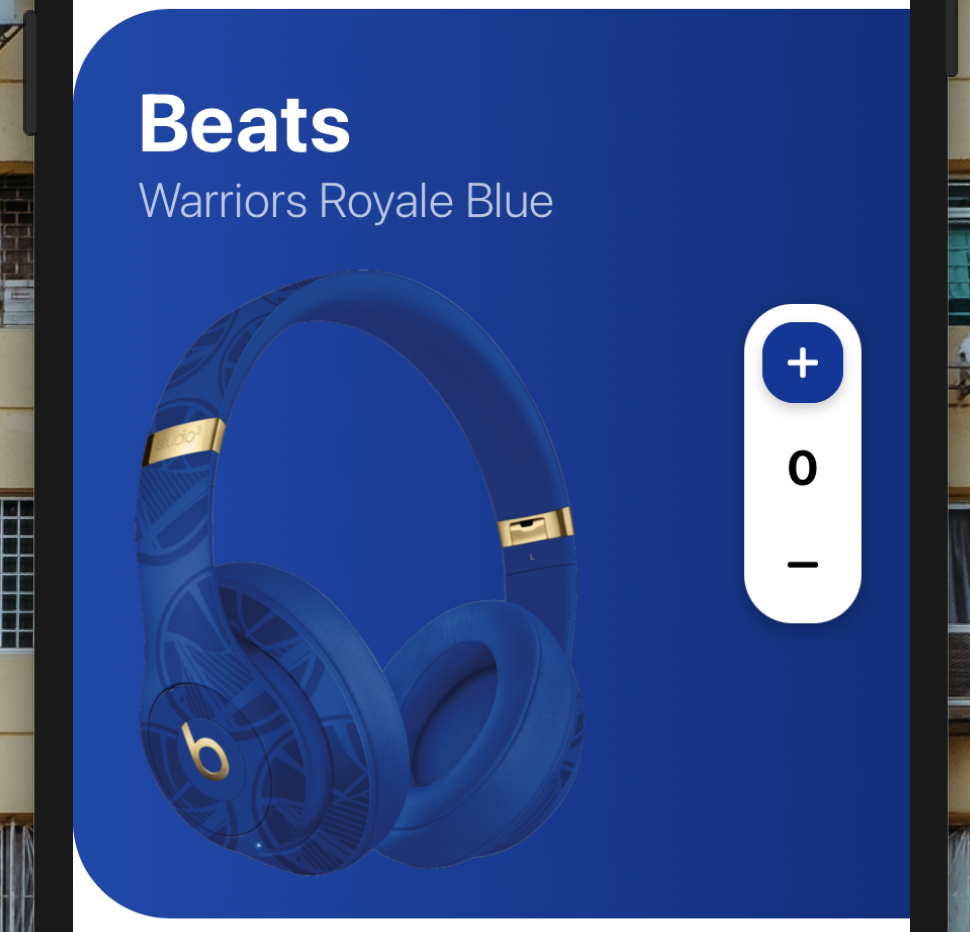
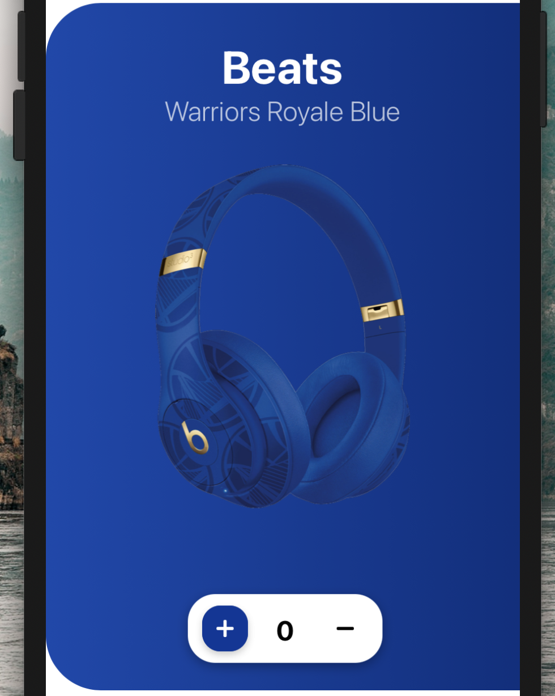

[](https://github.com/WrathChaos/react-native-counter-input)

[](https://www.npmjs.com/package/react-native-counter-input)
[](https://www.npmjs.com/package/react-native-counter-input)

[](https://opensource.org/licenses/MIT)
[](https://github.com/prettier/prettier)

<p align="center">
  
  
</p>

<p align="center">
  
</p>

# Installation

Add the dependency:

```bash
npm i react-native-counter-input
```

## Peer Dependencies

<h5><i>IMPORTANT! You need install them</i></h5>

```js
"@freakycoder/react-native-bounceable": ">= 0.1.1",
```

# Usage

## Import

```jsx
import CounterInput from "react-native-counter-input";
```

## Fundamental Usage

```jsx
<CounterInput
  onChange={(counter) => {
    console.log("onChange Counter:", counter);
  }}
/>
```

# Configuration - Props

| Property                      |   Type    |  Default  | Description                                                                               |
|-------------------------------|:---------:|:---------:|-------------------------------------------------------------------------------------------|
| style                         |   style   |  default  | change/override the main container style                                                  |
| horizontal                    |  boolean  |   false   | make the button horizontal design                                                         |
| initial                       |  number   |     0     | set the initial value for the counter input                                               |
| onChange                      | function  | undefined | set your own logic for onChange method, it triggers on any change                         |
| onChangeText                  | function  | undefined | it triggers when the TextInput changes                                                    |
| onIncreasePress               | function  | undefined | it triggers when the increase button is pressed                                           |
| onDecreasePress               | function  | undefined | it triggers when the decrease button is pressed                                           |
| backgroundColor               |  string   |   #fff    | change the CounterInput's background color                                                |
| min                           |  number   | undefined | set a minimum input value                                                                 |
| max                           |  number   | undefined | set a maximum input value                                                                 |
| reverseCounterButtons         |  boolean  |   false   | reverse the counter buttons                                                               |
| increaseButtonBackgroundColor |  string   |  #0b349a  | change the CounterInput's active increase button background color                         |
| decreaseButtonBackgroundColor |  string   |  #0b349a  | change the CounterInput's active decrease button background color                         |
| ImageComponent                | component |   Image   | set your own Image component instead of default `RN Image` component such as; `FastImage` |

## Future Plans

- [x] ~~LICENSE~~
- [x] ~~Horizontal Feature~~
- [ ] Animation
- [x] ~~Reverse Horizontal +/- Buttons Option~~
- [ ] Write an article about the lib on Medium

## Credits

Heavily Inspired by [Enes Kargıcı](https://dribbble.com/shots/6530185-Beats-Mobile-App-Concept-Design), thank you so much!

## Author

FreakyCoder, kurayogun@gmail.com

## License

React Native Counter Input is available under the MIT license. See the LICENSE file for more info.
